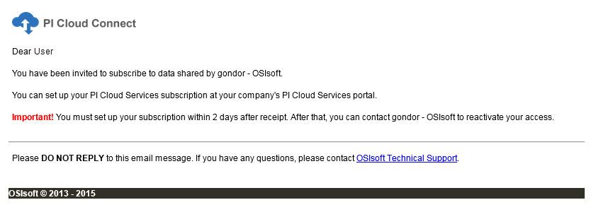

# Add subscribers

Publication owners can invite users to subscribe to publications. Users who are not publication owners can only view and subscribe to publications to which they have been invited. Perform the following steps to invite users to a publication.

## Procedure

1. Click **Publications** in the left menu.

1. Click a publication.

1. In the header, click **View Details/Manage Subscribers**.

1. Click **Invite Subscribers**.

1. Enter the subscriber email and subscriber tenant alias.

1. Click the **checkmark button** in the bottom right corner of the screen. An email invitation is sent to the user. Users are added to the subscriber table with a Configured value of No.

   **Note:** While you can add multiple subscribers to a publication, you can add only one subscriber at a time.

   

   **Note:** The user has two days to accept the invitation before it expires. After that point a new invitation must be sent.

1. Once the user subscribes to the publication, the Configured value will change to Yes. The account name and publication status will also display for the user. For information on publication status, see [Publication details](xref:publication-details).
