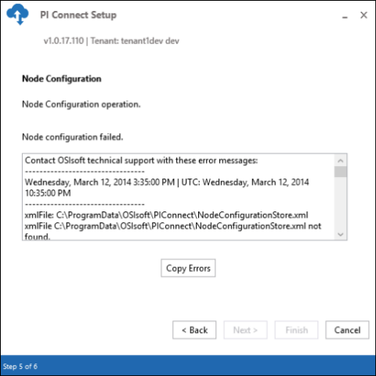

# Error during node deployment

The following error may occur when installing the PI Cloud Connect setup kit.

| Issue | Resolution |
| ----- | ---------- |
| When deploying a new node, the setup kit might not be able to complete successfully. | Click the **Copy Errors** button to copy the content of the error log to your clipboard. Then create a case through the [OSIsoft Customer Portal](https://my.osisoft.com/) and paste the copied errors into your case. |
