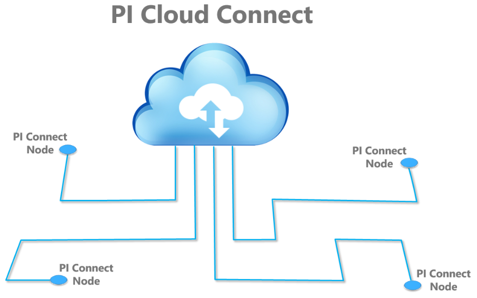

# How PI Cloud Connect works

PI Cloud Connect is a Microsoft Azure hosted application that uses a publish and subscribe mechanism to manage the data flow between PI Systems. Users first have their account manager create a user account for them. They can then sign into the PI Cloud Connect customer portal to install the components required to securely and reliably connect their PI Systems and share data. Customers use the PI Cloud Connect customer portal to manage publications, subscriptions, users, and nodes.

The following are the major components of the PI Cloud Connect service:

| Component | Description |
| --- | --- |
| Publication | An automated transfer of data (such as AF Elements and AF Templates) over the cloud from a PI System to a node. |
| Subscription | A contract that enables a specific user to receive a read-only version of the data associated with the publication. |
| Users | An account setup to provide a specific user to have access to create publications and add subscribers to publications. |
| Nodes | Nodes are computers that have had the PI Cloud Connect setup kit installed on them. These computers can then be used to receive data over the cloud from the connected PI System. |
