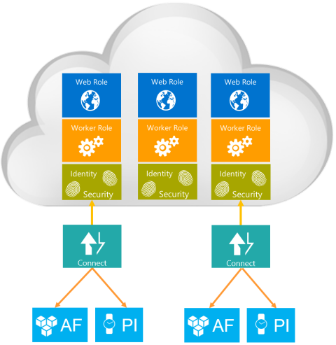

# Overall data flow

Data flows between Windows services on-prem and Windows Azure components of PI Cloud Connect.

The diagram below shows the data flow between the Windows services running on-prem and the Windows Azure components of PI Cloud Connect leveraging the Azure service bus relay. Each account has its own dedicated service bus endpoints for each of the PI Connect node deployed. Each account can deploy multiple nodes, each node being a publisher, a subscriber or both.
 

