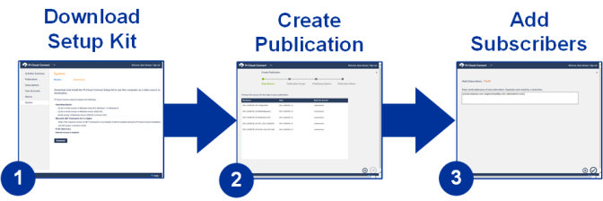

# Data sharing workflow

As a destination for data sharing, users can create a subscription associated with publications that they have been invited to access. The association between a publication and a subscription is a contract between the publisher and subscriber that specifies what data is being shared. When the configuration of the publication and the associated subscriptions is complete on both sides and the publication and the subscription are started, the exchange of data commences and continues until either the publication or subscription is stopped.
 

1. Download the PI Cloud Connect setup kit: The first step in sharing data is to download the PI Cloud Connect Setup Kit. The setup kit installs the necessary components for connecting to the PI AF server. An internet connection is necessary to designate a computer as a node. A PI Connect node is a computer where the PI Connect components have been installed. The setup kit can be downloaded from the System page. See the [system](xref:system) topic for more information.

1. Create the publication: The second step is to select a data source to include in the publication. A publication is configured by selecting a PI AF Element from any PI AF server that is accessible from a registered PI Connect node. See the [Create publications](xref:create-publications) topic for more information.

1. Add subscribers: Once a publication is configured, the publisher can invite other PI Cloud Connect users to subscribe to that publication. After a subscriber is added to a publication, an automated email will be sent to the subscriber to notify them that they have access to the publication. For this reason, the publisher needs to have prior knowledge of the subscriber's contact information prior to using PI Cloud Connect. For trans-enterprise data exchange, it is highly recommended that publishers and subscribers establish a business relationship to define the scope of the data exchange and share contact information. See the [Add subscribers](xref:add-subscribers) topic for more information.
