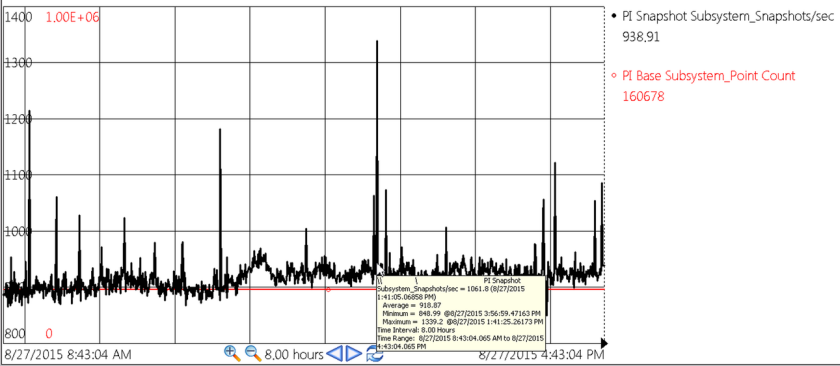

# Performance and throughput

Performance metrics on the number of events per second for data publishing and subscribing, and the number of tags available at startup.
   
PI Cloud Connect can sustain a data transfer rate of approximately 8,000 events/sec per node for up to 100,000 PI Tags.
 
In general when publishing or subscribing to data at a rate of approximately 4,000 events/sec, 120 Kbytes/sec of network throughput will be utilized on a constant basis. As a comparison, average OSIsoft customer PI Interfaces have data rates of about 50 events/sec per 1,000 tags. Given an average customer, the bandwidth required per thousand (1,000) tags is approximately 2.9 Kbytes/sec.
 
For PI Cloud Connect implementations that will be publishing or subscribing to data at rates approaching or exceeding 2,000 events/sec, it is recommended that the `totalupdatequeue` and `maxupdatequeue` Tuning Parameters on the PI Data Archive be adjusted to meet the needs of the system. Data transmission that exceeds the configured maximum for the PI Data Archive Update Queue, or exceeds 8,000 events/sec, will not be lost, but instead simply delayed. This engineering design takes into account that the publisher is likely to lose connection to the internet from time to time, and will need to occasionally send bursts of data when necessary. This enables PI Cloud Connect to continue delivering time-series data despite intermittent loss of internet connection.
 
The following sections provide information for determining whether PI Cloud Connect can accommodate the volume and velocity of data you want to publish, as well as how to estimate how the throughput of your data matches up to the maximum 8,000 event/sec throughput that PI Cloud Connect can handle.

## Incorrect throughput estimation

When estimating the throughput for a set of PI Tags, it is common to simply consider the number of tags, assume the highest scan rate, and assume each scan returns an event. For example, for a set of 5,000 PI Tags each having a scan every second, one would estimate:

(5,000 tags) * (1 scan/sec) * (1 event/tag*scan) = 5,000 events/sec

While this is logical and does predict the upper limit of throughput, it is not accurate of the actual throughput. In actuality, some events are filtered due to PI Tag exception settings on interfaces, PI Tags may have different scan rates, and the data source may not offer a new event on every scan.

## Correct throughput estimation

A typical OSIsoft customer pushes 50 events/sec per 1000 PI Tags to a PI Server (this number is actually the median data density being pushed to PI Servers by customers utilizing standard interfaces). If the only data available is the tag count and standard interfaces are being used, then this median data density can be assumed and utilized for a rough estimate of the throughput for a PI Server. For example, a PI Data Archive with 5,000 tags would have an estimated throughput rate of (5,000 tags) * (50 events/sec*1000 tags) = (5,000 * 50) / 1000 = 250 events / sec.

## Throughput estimation using performance monitoring

Performance Monitoring on the PI Data Archive can be used to pinpoint the throughput for a specific PI Data Archive. Referring to [Build performance monitor points](https://docs.osisoft.com/bundle/pi-server/page/build-performance-monitor-points.html), configure the Performance Tag for the "PI Snapshot Subsystem_Snapshots/sec". Determine the average over a period of days, or even hours as shown in the example below. If the average is less than 8,000 events/sec, then you can safely publish your entire PI System through PI Cloud Connect.

## Example

In the example below, the PI Data Archive has 160,678 tags. Evaluating the throughput utilizing the tag count and estimated scan rate only (as depicted in the scenario on how not to estimate throughput) would result in: (160,678 tags) * (1 scan/sec) * (1 event/tag*scan) = 160,678 events/sec. The trend and values shown below reinforce the inaccuracy of this estimate:

By configuring the PI Snapshot Subsystem_Snapshots/sec Performance Monitoring data point, it is possible to see that the data rate is variable between 848 and 1,339 events/sec, with an average of 918 events/sec. Several things can impact the resulting rate: it is likely that the scan rate for interfaces is less frequent than 1 second, the data source may not serve up new values for each scan, or the interface may also be performing exception processing. All of these factors can impact the actual event rate shown here. For this example a data density of 5.7 events/sec per 1000 tags, would result in a throughput easily handled by PI Cloud Connect if all of the tags on the PI System were Published. Given that 80% of PI Systems today have a snapshot event rate of less than 4,000 events/sec, the same would be true for most use cases.
