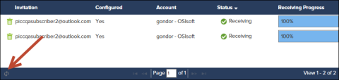

# Publication details

The Publication Details page displays in-depth information about each publication, as well as options for modifying publication description and managing subscribers. Users can access Publication Details by clicking the publication and clicking View Details/Manage Subscribers in the table header. The Publication Details popup opens displaying detailed information regarding the publication.
 
Created By – The name of the account associated with the publication.
 
Description – Text entered describing the purpose of the publication. This text can be manually edited at any time.
 
Publication Type – Whether the publication is sending time series data and AF Elements or AF Element Templates.
 
Date Created – The date the publication was added.
 
Node – The name of the PI Connect node that is associated with the publication and sending the data. An icon also shows the current status of the node.

**Note:** To modify the Node, delete and recreate the publication.

Data Source – The AF path that is targeted for this publication and from which the data is being extracted.

**Note:** To modify the Data Source, delete and recreate the publication.

Status – Whether the publication has been started, and whether the publication is sending data. Click **Start** or **Stop Publishing** to begin publishing or stop publishing.

**Note:** Publication Status is updated every 10 minutes.

- **Sending (green checkbox)** – The publication is started and is currently sending data.

- **Not Sending (red exclamation point)** – The publication is started but is not sending data.

  **Note:** If status is Not Sending, contact [OSIsoft Technical Support](https://my.osisoft.com/).

- **Stopped (yellow exclamation point)** – The publication is not started.

Subscribers Table – A list of users that have been invited to subscribe to the publication. Click Invite Subscribers and enter an email address to invite a user to subscribe. The user will receive access to the publication and an email inviting them to subscribe. See [Add subscribers](xref:add-subscribers) for more information on inviting users to subscribe to publications.

- Invitation – The email address of the user that was given access to the publication. That user also received an email invitation to subscribe.

- Configured – Whether the user subscribed to the publication.

- Account – The company name associated with the account of the subscriber.

- Status – Whether the subscription is receiving data. See [Subscription details](xref:subscription-details) for information on Subscription Status.

- Receiving Progress – The current percentage of total bytes received from a publication for a subscription. Click the refresh button at the bottom of the page to reload the progress bar.

  **Note:** The Receiving Progress bar is an optional feature, and may not display depending on your account's configuration. The Receiving Progress bar can be updated once per minute.

  

  **Note:** If the Receiving Progress bar does not increment upon reload, contact [OSIsoft Technical Support](https://my.osisoft.com/).
