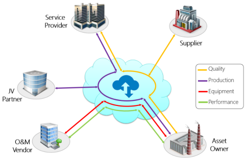

# Share data with other corporations

As part of any business collaboration, such as joint ventures, contract manufacturers, expert service providers, and operations and maintenance companies, all partners need access to production data. Access to production data enables partners to plan ahead for events such as scheduling equipment maintenance or the delivery of critical components. Sharing this data typically requires the installation of VPN networks at each PI System location.
 
PI Cloud Connect provides all parties with a secure way of sharing data between their respective PI Systems without having to deploy point-to-point VPNs in multiple scenarios:
	
- In a joint venture, even though only one company usually operates the assets, all partners need access to the production data.
	
- To deliver the best service possible, partners and vendors who supply raw materials, equipment, or expertise need access to the time series data collected at the operations sites.
	
- Contract manufacturers, who manufacture products on behalf of other companies need to expose the operation and quality data to those companies.
	
- Operations and Maintenance companies (O&amp;M), Service Providers (SP), and Performance Analytic Vendors (PAV) also need access to the time series data on site to provide expert knowledge about the efficiency and health of equipment such as pumps, compressors, generators, or other components or additives that are critical to a certain process.
	

