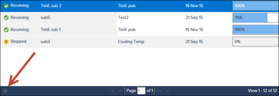

# Subscriptions

The Subscriptions page lists all subscriptions that have been configured for your account. Select a subscription in the list to start or stop a subscription, view subscription details, or delete a subscription. To create a subscription for a publication you have been invited to access, go to the Publications page and click **Subscribe** for a publication. See [Create subscriptions](xref:create-subscriptions) for more information. To add subscribers to a publication created by your account, go to the Publications page and click **View Details/Manage Subscribers** for a publication. See [Add subscribers](xref:add-subscribers) for more information.
 
Status – Indicates whether the subscription is currently receiving data, has been manually stopped, or has been started but is not receiving data. Subscription Status updates every ten minutes.

**Note:**  If Subscription Status is Not Receiving, contact [OSIsoft Technical Support](https://my.osisoft.com/).

Source Publication – Lists the publication sending the data. If a publication has been deleted, the field will display Publication Removed. To change the Source Publication or Data Destination for a subscription, delete and recreate the subscription.
 
Receiving Progress – The current percentage of total bytes received from a publication for a subscription. The Receiving Progress bar is available for reload once per minute. Click the refresh button at the bottom of the page to reload the progress bar:

**Note:** The Receiving Progress bar is an optional feature, and may not display depending on your account's configuration.

**Note:** If the Receiving Progress bar does not increment upon refresh, contact [OSIsoft Technical Support](https://my.osisoft.com/).
