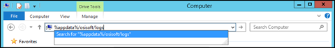

# Access local log files

The PI Connect Windows service maintains a log of information about its operation. These logs are located in the `%AppData%\OSIsoft\logs` folder for the user account running the PI Connect Windows service.

If you suspect a problem with PI Cloud Connect on a specific PI Connect node, contact OSIsoft Technical Support and send the log files through the [OSIsoft Customer Portal](https://my.osisoft.com/).

