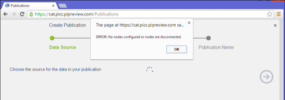

# Cannot access PI AF
   
When creating or subscribing to a publication, the first step is to select a data source/destination from/to PI AF. An error message may occur when the PI Cloud Connect Customer Portal cannot access the PI AF servers. Follow the troubleshooting steps below to resolve the issue. If the steps below do not resolve the issue, contact [OSIsoft Technical Support](https://my.osisoft.com/).
 

| Issue | Resolution |
| ----- | ---------- |
| No PI Connect nodes have been configured for your account. | Add a node to the account. |
| The PI Connect nodes are not reachable. | Validate the node’s status icon on the System page. |
| Communication between the Azure components and the on prem components is failing. | The PI Connect Windows Service is down. |
| Connection between the PI Connect node and the PI AF server is failing. | <ul><li>PI AF is unavailable/shutdown.</li><li>The service account for the PI Connect service does not have access to your PI AF Server and/or PI AF Database.</li></ul> |
