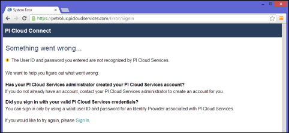

# Unable to sign into the PI Cloud Connect Customer Portal
   
You may have problems signing into the PI Cloud Connect Customer Portal if the system cannot validate your Microsoft account. This may be due to lack of activation, incorrect username and password, or if your Microsoft account is not associated with a PI Cloud Connect user account. The following error message is displayed when an authentication against a Microsoft account fails.

Review the following causes and resolutions to resolve this error message:

| Cause | Resolution |
| ----- | ---------- |
| You have not verified your e-mail address in order to complete the Microsoft account setup process. | Check your inbox for a signup verification email. |
| Microsoft account/password combination provided is invalid. | Re-enter the account/password information. |
| Microsoft account credentials were cached in your browser and you were not explicitly presented with the Microsoft account sign in page. | Access the Microsoft account sign in page to login. |
| Your Microsoft account credentials are valid but they are not associated with a user in PI Cloud Connect. | <ul><li>You are not yet a user in PI Cloud Connect for the account you are trying to access. Contact the account administrator to request access to the account.</li><li>You used a different Microsoft account when you activated your PI Cloud Connect user account. Enter the username/password information for the Microsoft account that you used to activate the user account.</li></ul> |

If you are still having issues, contact OSIsoft technical support at [https://my.osisoft.com/](https://my.osisoft.com/).
